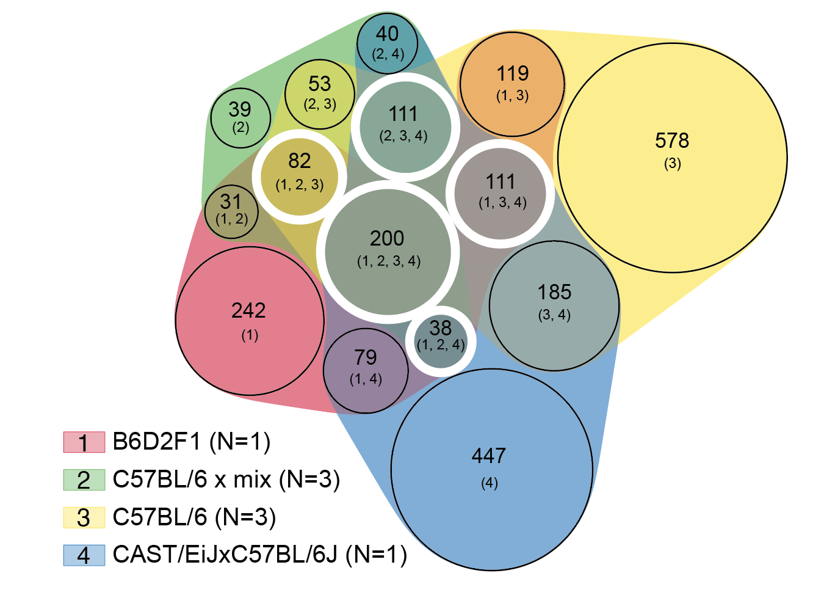
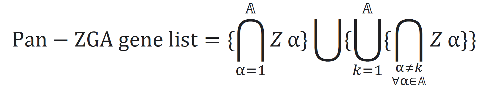
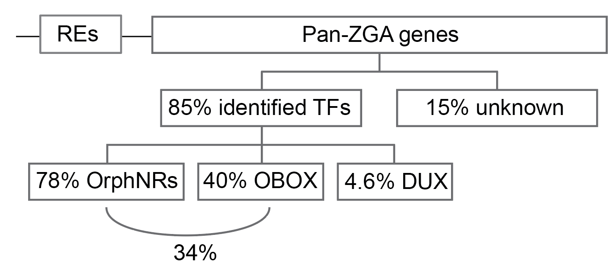

# Rise and SINE

The repository contains scripts for the analysis and plot generation for
"Rise and SINE: roles of transcription factors and retrotransposable elements in zygotic genome activation of mammalian embryos" Pavel Kravchenko and Kikue Tachibana. _Nat. Rev. Mol. Cell Biol._ (2024). https://rdcu.be/dV0HG

0. RNA-seq data loading and processing - ```sbatch_scripts```
1. RNA-seq analysis and figures generation (Figures S1 A and C) - ```RNA_seq_analysis_and_figures.Rmd```
2. Figure S1D1 generation - ```./Figures/Figure_S1/Figure_S1D1/Figure_S1D1.ipynb```
3. Figures S1D 2 and 3 generation - ```./Figures/Figure_S1/Figure_S1D23/Figure_S1D23.ipynb```
4. Figures S1 E and F generation - ```./Figures/Figure_S1/Figure_S1_E_and_F.ipynb```

Pan-ZGA lists of different degrees can be found in the ```pan_ZGA_lists``` directory. Pan-ZGA list of the 1st degree is used in the work (```./Pan_ZGA_lists/Pan_1_degree_ZGA_genes.csv```).



Figure S1A. Venn diagram of ZGA list intersections grouped by mouse strain background. The core intersection consists of 200 ZGA genes. Overlaps comprising the pan-ZGA genes list of the 1st degree are indicated by white circles. The pan-ZGA genes list of the 1st degree consists of 542 genes (See Formula 1).
</br></br>


Formula 1. Selection of pan-ZGA genes. The union of the intersection of all individual ZGA gene lists in 𝔸={Z1, Z2, …, Zn} with the union of intersections of all individual ZGA gene lists but one indexed as k, where k is every ZGA list from 𝔸. Pan-ZGA genes of 2, 3, …, n-1 degree could be produced similarly, excluding 2, 3, …, n-1 k datasets, respectively. The first argument of the intersection of all individual ZGA gene lists was isolated to introduce the core ZGA list explicitly.
</br></br>


Figure S1B. Pan-ZGA genes are partially controlled by orphan nuclear receptors (OrphNRs), OBOX and DUX. Pan-ZGA genes intersect with 85% of overlapped downregulated genes upon OrphNRs, OBOX or DUX perturbation, leaving 15% of genes regulated by currently unknown factors. The former category is comprised of 78% regulated by OrphNRs, 40% regulated by OBOX, and 4.6% regulated by DUX. OrphNRs and OBOX together regulate 34% of pan-ZGA genes.
</br></br>

## Before you start

Make sure that you have installed:
<ul>
<li>Python 3.7 (or upper) https://www.python.org/
<li>R 4.2.1 (or upper) and RStudio https://posit.co/download/rstudio-desktop/
</ul>

Please use the provided ```environment_py37.yaml``` and ```R_sessioninfo.txt``` to match the environment

## Getting started

First of all, you have to ```clone``` this directory</br></br>
```git clone https://github.com/Pavel-Kravchenko/Rise_and_SINE/```</br></br>
Then ```cd``` in Rise_and_SINE </br></br>
```cd Rise_and_SINE```</br></br>
